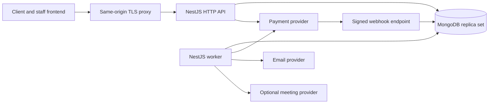
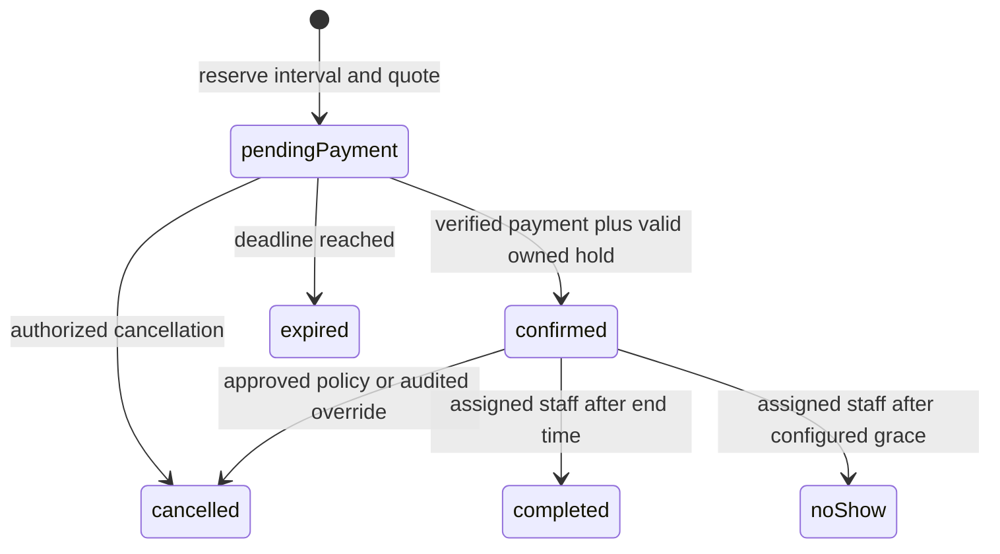

# NestJS and MongoDB backend design

Status: proposed implementation design, prepared 2026-09-26. NestJS and MongoDB are the owner's selected technologies. This package designs the new backend; it does not claim a backend is running, deployed, or concurrency-tested.

Start here, then read the [MongoDB model](MONGODB-MODEL.md), [API plan](API-PLAN.md), and [delivery plan](DELIVERY-PLAN.md). The baseline is [BACKEND-REQUIREMENTS.md](../redesign/BACKEND-REQUIREMENTS.md); the current frontend contract is [openapi.json](../redesign/openapi.json).

## 1. Decisions and scope

Build one modular NestJS application with two entry points: an HTTP API and a background worker. Use TypeScript, the Express adapter, `@nestjs/mongoose`, and a MongoDB replica set. Keep domain logic shared between API and worker. Start with MongoDB-backed durable inbox/outbox work and leases; Redis and an additional queue service are not required for this first design.

The owner's MongoDB choice replaces the earlier relational-store proposal. Relational foreign keys, row locks, and interval exclusion constraints must not be copied as if MongoDB supplied them. This design replaces them with validated references, unique indexes, shared guard documents, and multi-document transactions. These invariants need real-database acceptance evidence before release.

Use a separate backend codebase when implementation begins, with a neutral working directory/package name such as `linde-api`. No remote or repository name is reserved by this design. The ongoing frontend remake already has changes in this workspace; the legacy-code inventory in the requirements is historical evidence, not the present frontend implementation.

One firm is the initial tenancy boundary. Every deployment serves that firm. Multi-firm SaaS, legal case management, uploads, automated legal advice, and automated conflict screening are outside this design. Add a tenancy model through a separate decision before hosting independent firms together.

Stripe is the proposed first payment adapter because the client contract already uses Stripe concepts. Its production account, supported methods, currencies, and commercial policies remain firm decisions. A mail adapter and optional meeting adapter isolate provider integrations.

The compatible MVP has one checkout currency per service and one active duration-based price, with no lawyer/mode price variation. Each assigned lawyer must cover the service's entire advertised jurisdiction scope because availability/booking inputs do not select a jurisdiction. Use separate services for distinct scopes or review a contract increment before offering partially overlapping eligibility. Never infer required jurisdiction from the client's nationality or optional summary. Price and notice activation is immediate in this MVP; scheduled activation requires a later explicit workflow.

## 2. Deployment and ownership



The API performs bounded request work. The worker claims durable work from MongoDB and runs expiry, delivery, reconciliation, and reminders. Both use the same transition services and guard protocol. A second worker or API instance cannot bypass database coordination.

MongoDB owns business truth, sessions, durable idempotency, job state, and audit records. Provider objects own the external money facts. Neither a browser redirect nor a successful email proves payment or booking confirmation.

Nest supports Mongoose model registration and injection of its managed connection for sessions; keep those details inside infrastructure repositories. [NestJS MongoDB integration](https://docs.nestjs.com/techniques/mongodb)

### Modules

- **IdentityModule:** accounts, verified identity, sessions, CSRF, action tokens, role grants, MFA, account revocation. Exports principal and permission checks, never password hashes.
- **CatalogueModule:** published topics/services, approved lawyer profiles, eligibility, immutable price and policy versions, current price selection. Only allowlisted public projections leave this module.
- **SchedulingModule:** local recurring rules, exceptions, timezone expansion, advisory slot offers, occupied intervals, and schedule guards. Exports transaction-aware reservation/release operations.
- **BookingsModule:** booking aggregate, lifecycle, immutable quote and policy snapshots, ownership, cancellation and staff assignment. Orchestrates catalogue and scheduling through explicit service interfaces.
- **IntakeModule:** minimal intake and acknowledgement records, separate read permissions, audited staff access. Legal narratives never appear in generic booking projections.
- **PaymentsModule:** provider adapters, attempts, refunds, inbox processing, financial guards and reconciliation. Only verified provider facts can request a paid confirmation.
- **NotificationsModule:** outbox delivery, localized templates, reminders and optional meeting provisioning. External delivery has at-least-once semantics with deduplication where supported.
- **OperationsModule:** exception queues, safe retries, staff orchestration and audit queries. It calls domain commands rather than directly updating their collections.
- **PlatformModule:** validated configuration, database transactions, clock, request IDs, redaction, idempotency coordinator, health and metrics.

Controllers handle transport, guards and DTOs. Application services enforce policies and transaction boundaries. Pure domain functions handle money, state transitions and eligibility. Repositories require an explicit session for transactional work. Avoid generic CRUD endpoints, implicit population of sensitive data, and circular module dependencies; inject narrow ports when orchestration crosses modules.

Proposed source layout:

```text
linde-api/
  apps/api/src/                  HTTP bootstrap and root module
  apps/worker/src/               worker bootstrap and processors
  libs/modules/
    identity/ catalogue/ scheduling/ bookings/ intake/
    payments/ notifications/ operations/
  libs/platform/                config, clock, DB, errors, logging
  contracts/                    versioned OpenAPI and synthetic fixtures
  migrations/                   explicit collections, validators, indexes
  test/integration/             real replica-set transaction tests
  test/contracts/               producer and frontend-consumer checks
  test/provider/                signature and sandbox payment workflows
  infra/                        local containers and deployment definitions
```

Within each domain use `api/`, `application/`, `domain/`, and `infrastructure/` only where they add useful separation. Pin compatible runtime/package versions and a lockfile during bootstrap; this design does not invent a tested dependency matrix.

## 3. MongoDB transaction protocol

MongoDB transactions need a replica-set deployment; snapshot reads alone do not serialize independent booking inserts. Updating a shared document establishes contention and lets conflicting transactions abort/retry. Those are database primitives; the guard protocol below is this application's proposed design. [MongoDB transaction considerations](https://www.mongodb.com/docs/manual/core/transactions-production-consideration/)

Pre-create one catalogue guard per service, one schedule guard per lawyer, and one financial guard per booking. Never rely on an in-process mutex or a Redis lease for interval exclusivity. Every relevant writer, including staff operations and the worker, must follow this protocol:

1. Determine the resource IDs; reads outside the transaction only discover the intended lock set.
2. Begin a transaction on the primary with snapshot reads and majority writes. Increment guards in this global order: service IDs sorted, lawyer IDs sorted, booking financial IDs sorted. Every guard update must change the document. A missing guard is an integrity error, not permission to proceed unlocked.
3. Re-read and validate affected records inside the transaction. If assignment or the required guard set changed, abort and restart with the correct resources. Never acquire a newly discovered earlier-order guard late.
4. Apply predicates and writes, explicitly passing the same session to every repository. Commit domain changes, audit, outbox, and applicable idempotency results together.
5. Use bounded whole-transaction retries for transient write conflicts. Handle uncertain commit outcomes with the driver's commit-retry semantics and durable operation identity. Exhaustion returns a retryable dependency error; it never invites creation of a different payment attempt.

Transactions contain database operations and pure computation only. Do not send email, call Stripe, or generate another externally visible side effect inside a callback that may rerun. Do not run database operations in parallel on one transaction session. [Mongoose transactions](https://mongoosejs.com/docs/transactions.html)

Catalogue publication/price changes take their service guard. Lawyer eligibility and schedule changes take the lawyer guard. Reservation takes both, so a concurrent disable or price switch has a defined serialization order. Previously created bookings retain snapshots; a later disable raises an operational review where necessary instead of silently cancelling paid work.

Guard serialization deliberately limits simultaneous writes to the same lawyer, and to the same service during reservation creation. That tradeoff is reasonable for an initial firm but must be measured. Split guards only after defining and testing an equivalent consistency protocol; there is no throughput claim here.

### Create a booking

The selected offer format is an opaque, cryptographically random 32-byte token encoded within the existing 128-character slot-ID limit. A `slotOffers` record indexed by its token hash binds service, eligible lawyer, duration, language, mode, UTC instants, offer expiry and relevant configuration versions. It contains no client identity. `expiresAt` expires the offer; it does not hold time. Availability is always advisory. Enforce bounded queries, issuance limits and eventual cleanup so anonymous availability searches cannot grow the offer store without control.

The command performs this sequence:

1. Authenticate a verified client; validate CSRF, origin, payload and `Idempotency-Key`. Resolve the opaque slot offer and bind it to the submitted choices. Pre-read affected held bookings to identify their financial guards as part of the resource set.
2. Enter the guard transaction. Sample the trusted server clock after guard acquisition on every retry; never accept browser time. Revalidate offer expiry, service publication, eligibility, schedule, notice versions, lead time, price and exact instants.
3. Re-read relevant held bookings after taking catalogue, lawyer and affected booking financial guards in order. If an affected financial guard was not included, restart with the expanded set. Transition elapsed bookings to `expired`, release occupancy, and enqueue payment reconciliation/cancellation work atomically. This path must work while the expiry worker is offline. Bound the affected set; on an abnormal backlog, commit bounded cleanup batches under guards and retry the reservation from the beginning, never ignore remaining occupancy.
4. Expand configured buffers to the occupied half-open interval. Conflict exists when `existingStart < proposedEnd` AND `existingEnd > proposedStart`. Adjacent occupied intervals may coexist. A unique start-time index cannot express this rule.
5. If occupied, return `409 SLOT_UNAVAILABLE`. Otherwise insert the booking, its occupancy, its financial guard, the immutable quote/policy snapshots and the idempotent result in one commit. Assign a concrete lawyer before responding.

The resulting state is `pendingPayment` with `holdExpiresAt`; the initial quote's `expiresAt` equals that hold deadline. Generate the ID once per durable operation; transaction retries must not leak multiple bookings. Do not TTL-delete bookings or occupied intervals. TTL cleanup is asynchronous and cannot enforce a deadline. [MongoDB TTL behavior](https://www.mongodb.com/docs/manual/core/index-ttl/)

The serialization point for expiry is the guarded state transition using trusted server time. A confirmation begun after the deadline expires the hold even if a worker has not run. A short confirmation transaction that validly checks the hold before the deadline may commit afterward; a conflicting expiry/reassignment waits or retries and then observes the committed state. Bound transaction duration and monitor clock skew; do not claim a wall-clock commit deadline the database does not enforce.

### Booking lifecycle



`expired`, `cancelled`, `completed`, and `noShow` do not revive through the normal API. A booking retains independent payment and refund facts. Reading an elapsed pending booking must perform or trigger the same guarded expiration before returning authoritative detail; list projections must not misleadingly present it as an available payable hold.

### Timezones and schedule edits

Store instants as UTC and recurring rules as local date/time plus an explicitly configured IANA zone. Duration is elapsed minutes; display timezone does not affect availability. Generate bounded candidate intervals, apply eligibility, exceptions and buffers, then issue offers.

Proposed DST rule: skip nonexistent local start times; for ambiguous starts require an explicit first/second occurrence policy on the schedule and reject publication without one. Expose real UTC instants so any allowed repeated local label remains distinguishable. An overnight rule explicitly ends on the following local date. Persist expanded instants and buffers on bookings so subsequent rule/timezone changes cannot move them.

Schedule changes cannot erase occupied intervals. Reject new time-off/eligibility changes that require silently breaking commitments; return affected booking IDs within staff permissions and require an explicit cancellation/reassignment workflow. Staff rescheduling acquires all old/new service, lawyer and booking guards in order, secures the replacement, then releases the old occupancy in the same transaction. Initially allow only confirmed bookings with unchanged service, duration, language, mode, currency and total; monetary changes require a separately designed client-approved adjustment workflow.

## 4. Payment and refund integrity

### Create or resume an intent

1. Authenticate owner and verified identity. Under the lawyer and financial guards, check booking version, live hold, quote and required acknowledgements. Optional summary alone is never a payment gate.
2. Persist one durable attempt for the booking/quote, with a stable provider idempotency key, expected amount/currency and provider account/environment. Concurrent callers attach to that attempt even when their HTTP keys differ. Commit before networking.
3. A leased executor calls the provider outside the transaction. Persist the resulting provider ID under guards, revalidating booking state. If it expired/cancelled in the meantime, do not expose a payable secret; enqueue retirement/reconciliation of the remote object.
4. Return only the owner's SDK fields. A request interrupted after provider creation resumes the same attempt/key. The worker finds unfinished attempts and reconciles them.

Lease takeover increments a fencing generation, so an old executor cannot overwrite a newer local result. Provider calls still use the same durable identity. Do not create another intent just because a request timed out.

Provider idempotency has a finite retention window; local attempt uniqueness must survive it. Stripe documents that keys may be pruned after at least 24 hours. Once the original key may have expired, first recover the remote object through stored IDs, webhook correlation or provider lookup; quarantine unresolved creation instead of blindly issuing another chargeable object. [Stripe idempotent requests](https://docs.stripe.com/api/idempotent_requests)

### Verified money and booking confirmation

The webhook route consumes the raw body, verifies the environment-specific signature, and persists a unique inbox event before acknowledging it. Invalid signatures receive a rejection; a database failure receives a retryable failure. A valid duplicate can receive success because the durable inbox owns processing. Nest's raw-body support should be configured at bootstrap. [NestJS raw body](https://docs.nestjs.com/faq/raw-body)

The processor retrieves current provider state when required, checks account/environment, intent association, amount and currency, then enters the lawyer/financial guard transaction. Do not use event arrival ordering as a state machine. Stripe explicitly documents duplicate and unordered webhook delivery. [Stripe webhooks](https://docs.stripe.com/webhooks)

- **Valid hold still owned:** record verified success, confirm once, convert held occupancy into committed occupancy, and insert a unique confirmation outbox event in one transaction.
- **Expired/cancelled booking or released occupancy:** record that funds really succeeded, keep the booking terminal, set `resolutionRequired`, and create an operational resolution task. An approved late-payment policy may create a full refund request; otherwise staff resolve it. Never steal another reservation.
- **Amount/currency/account mismatch:** quarantine the event and create an exception. Do not confirm or automatically attach an unknown payment to a booking.
- **Older failure after success:** retain succeeded. A failed attempt may be retried when the provider allows it; public `failed` is not globally an absorbing payment state.

A provider success timestamp does not restore ownership of a released slot. A browser success page polls the server and shows processing until the authoritative state changes. Normal client reads cannot mutate money facts based on a client claim.

### Cancellation and refunds

Cancellation takes the lawyer and financial guards, evaluates the snapshotted policy, releases occupancy and records the booking transition immediately. Retiring a pending intent and issuing a refund are separate durable effects. A payment racing cancellation is reconciled without reversing that booking transition.

Reserve each pending refund amount under the financial guard:

```text
availableRefundMinor = capturedMinor - succeededRefundMinor - pendingRefundMinor
```

Reject requests exceeding that balance. Timeout/unknown provider results remain pending and keep their reservation; release it only on a definitive failure or verified cancellation. Call the provider using the durable refund identity outside the transaction. Concurrent refunds and duplicate events cannot release or spend the same balance twice. Financial correction operations require explicit permission, reason and audit.

The reconciliation worker revisits stale creations, processing payments, inbox failures, late successes, pending refunds and contradictory totals. Deterministic repairs use the same transition services. Ambiguous cases enter a staff queue rather than guessing a price, owner or refund result.

## 5. Identity, privacy and API enforcement

Use opaque MongoDB-backed sessions and the current `session` cookie name: `Secure`, `HttpOnly`, `Path=/`, no broad Domain, `SameSite=Lax`. Prefer a same-origin reverse proxy. Preserve anonymous session-bound CSRF bootstrap; validate token plus trusted Origin on browser mutations, including login, registration and logout. Rotate session/CSRF identity after login and privilege changes. Provider webhooks use independent signature verification.

Login may create a session for an unverified client, but reservation and payment require verified identity. Role grants are server-owned; an administrator's operational access does not include intake by default. Staff require MFA and step-up for sensitive administration. Check current account/authorization epoch on authenticated requests; account disablement, password reset and role changes invalidate prior sessions.

Identity administration serializes changes affecting recovery-administrator eligibility through a pre-created singleton firm authorization guard, then locks affected users by sorted ID through their security revisions. Recheck that an eligible recovery administrator remains before committing account/grant/factor changes. Per-user locks alone cannot prevent two administrators from concurrently removing one another's last recovery access. This identity-only protocol does not mix with booking guard acquisition; cross-domain operational follow-up is a separate durable command.

Use a maintained Argon2id implementation with benchmarked cost, password length/size bounds, breached-password handling, constant-shape recovery messages and normalized unique emails. Token consumption is an atomic conditional transition. Throttle by IP plus account/session using shared counters or a configured infrastructure service; process-memory limits alone do not protect multiple replicas. Never log passwords, session cookies, action links, provider client secrets or legal narrative.

**Action mail without plaintext token persistence:** enqueue only user/purpose/request identifiers. At delivery, the worker generates a cryptographically random token in memory and stores its hash, issuance ID and expiry before sending the link. If a crash loses the plaintext, a bounded retry issues a new token rather than recovering it from an outbox payload. Include issuance ID in mail deduplication identity so a replacement is deliverable. Multiple uncertain deliveries can produce multiple valid short-lived links; consuming one atomically invalidates siblings for that account/purpose. Password reset also invalidates sessions. Document this delivery behavior and test crash boundaries; no exactly-once email guarantee is made.

Separate intake documents from appointment metadata and audit each privileged read. Assigned-lawyer access is checked at read time, including after reassignment. Enforce the configured edit cutoff and record actual notice versions/acceptance time. No inferred consent, prechecked declaration or mandatory sensitive immigration fields. Use TLS and encrypted disks/backups; apply explicit retention/export/deletion policies before collecting production data.

Use DTO validation with unknown-field rejection, allowlisted enum/type/length rules and explicit number/date conversion. Do not pass user objects as MongoDB queries or update operators. Adapt validation errors to the existing `{error:{code,message,requestId,fieldErrors?}}` envelope. Return `404` for another client's record and preserve valid sessions on ordinary `403`. Nest's validation pipe supports allowlisting and rejecting unexpected fields; the exact error mapping remains application work. [NestJS validation](https://docs.nestjs.com/techniques/validation)

Keep private responses `Cache-Control: no-store`, including intake and client-secret responses. Safe metadata projections must be explicit, not a blacklist applied to full Mongoose documents. Re-authorize idempotent replays; possession of a key never bypasses current ownership or access.

## 6. Durable idempotency and worker behavior

HTTP idempotency is scoped to actor, operation/resource and key with a canonical request hash. Store execution state, lease generation, resource references and a safe completed result. Same hash replays the original logical result; different hash returns `409 IDEMPOTENCY_CONFLICT`; in-progress work returns a documented retryable conflict with `Retry-After`. Publish a configurable initial 24-hour replay window. After expiry, atomically replace a completed record under its unique key if needed; never rely on TTL to remove it exactly on time. Unresolved work does not expire into a new side effect.

Booking creation/cancellation results commit with their business writes. Payment creation uses the durable attempt protocol and retains financial uniqueness beyond HTTP replay retention. Never persist client secrets in generic idempotency responses; retain a response descriptor and retrieve the same intent's secret only after reauthorization. If the intent has ceased being payable, return the documented terminal/recovery outcome in the reconciled contract rather than exposing a retired secret. This is an explicit exception to byte-identical secret-bearing replay and needs a contract test.

Outbox/inbox work uses an explicit processing status, `nextAttemptAt`, `leaseUntil`, `leaseOwner`, `leaseGeneration`, `attemptCount` and bounded errors. Claim atomically, reclaim elapsed leases, and condition acknowledgements on the claimed generation. Persist the business event before work begins. Polling discovers work even if a wake-up signal is lost. Provider/email calls remain outside database transactions.

Uniqueness of business event keys prevents duplicate local events. It cannot prove exactly-once remote mail delivery. Prefer provider deduplication or delivery-ID lookup; classify unknown sends explicitly. Reminders use booking ID, reminder kind and schedule version for deduplication. Recheck current state/version before sending; cancellation/rescheduling supersedes stale reminder work. There remains a narrow send-versus-cancel race across an external network; messages should link to current portal instructions.

## 7. Evidence and next decisions

The collection model, API plan and delivery plan are implementation inputs. Official documentation was checked for Nest/Mongoose integration, transaction contention, TTL behavior, raw-body handling, validation and provider retry behavior. The guard protocol and domain boundaries are our application design, not vendor guarantees about an unimplemented system.

Production blockers belong in the [delivery decision register](DELIVERY-PLAN.md): approved services/jurisdictions, currencies and price/tax rules, cancellation/refund policy, required screening/acknowledgements, schedule policy, provider ownership, staff permissions and data retention. Synthetic fixtures let engineering proceed while these remain open.

Before coding the booking workflow, reconcile and version the client contract and the proposed staff increment. Prove interval and financial races against the selected MongoDB deployment before enabling real payments.
